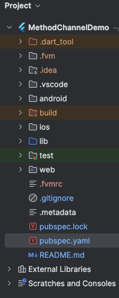

# methodchannel_demo

This is a simple method channel example where we implemented only to call Android native code using method channel from dart/flutter code.
After exectute this code, click on floating button then it will show the document list in logs

# Flutter Project structure
- `android: ` Contains android native code
- `ios: ` Contains ios native code
- `lib: ` Write flutter common code for all platforms in dart
- `test: ` test cases
- `web: ` Web application support, you create app for desktop then other folders will be there
- `pubspec.yaml: ` Contains packages, and project configuration as assets, flutter & dart versions, application code, version, app metadata, name etc

In project structure, I am using fvm to manage flutter versions for multiple apps that's why .fvm folder is there.
I use [sidekick](https://github.com/fluttertools/sidekick) for fvm

# Contact
- [Linkedin](https://www.linkedin.com/in/anil-sharma-b1b52378/)
- [Github](https://github.com/anilgsharma900)
- [Twitter](https://x.com/itsanilg)

## Getting Started Flutter Official docs

This project is a starting point for a Flutter application.

A few resources to get you started if this is your first Flutter project:

- [Lab: Write your first Flutter app](https://flutter.dev/docs/get-started/codelab)
- [Cookbook: Useful Flutter samples](https://flutter.dev/docs/cookbook)

For help getting started with Flutter, view our
[online documentation](https://flutter.dev/docs), which offers tutorials,
samples, guidance on mobile development, and a full API reference.

## Contributing

Contributions are welcome.
In case of any problems look at [existing issues](https://github.com/anilgsharma900/MethodChannelDemo/issues), if you cannot find anything related to your problem then open an issue.
Create an issue before opening a [pull request](https://github.com/anilgsharma900/MethodChannelDemo/pulls) for non trivial fixes.
In case of trivial fixes open a [pull request](https://github.com/anilgsharma900/MethodChannelDemo/pulls) directly.

